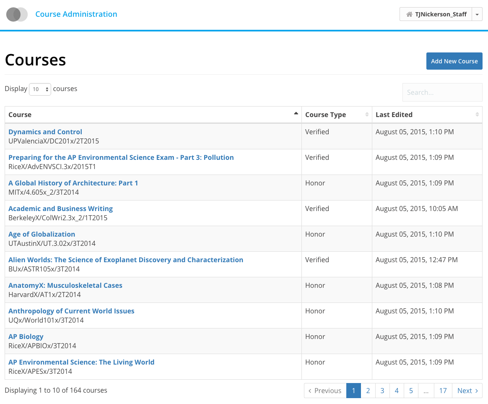

While at edX, I worked alongside the E-Commerce & Growth team to build and maintain the company's marketing site and checkout flow. While the majority of tasks I performed were maintenance tasks, towards the end of the my time at edX I spearheaded development of a course admininistrative interface course creators could use to manage their courses published on the edX platform (seen below). I also assisted the design team in modularizing their UI design system and moving it to Bower.

For a comprehensive write-up on my contributions to edX, see [this blog post](https://open.edx.org/blog/intern-spotlight-tyler-nickerson).

For a more detailed look at the commits I made to their systems, see [here](https://github.com/edx/ecommerce/pulls?q=is%3Apr+author%3ANickersoft+is%3Aclosed), [here](https://github.com/edx/edx-platform/pulls?q=is%3Apr+author%3ANickersoft+is%3Aclosed), and [here](https://github.com/edx/ux-pattern-library/pulls?q=is%3Apr+author%3ANickersoft+is%3Aclosed).

