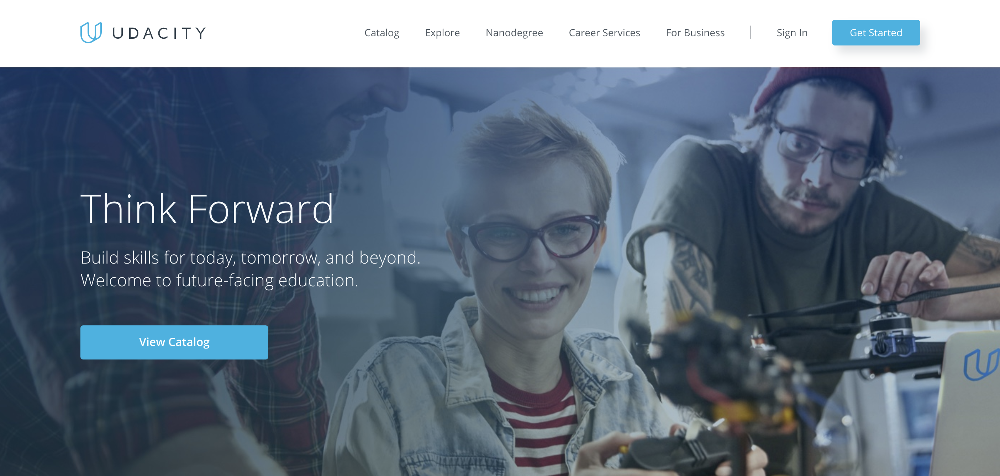

While at Udacity, I worked alongside the Global Growth Engineering team to build and maintain the company's international marketing websites. Collaborating with the design and marketing teams, I spearheaded development on a number of promotional campaigns, such as the Built On Blockchain campaign, and page launches, including the 2018 redesign of the U.S. homepage and course catalog.

Additional work included the development of in-house tooling to improve the speed in which our team could iterate, as well as leading a workgroup that produced over 30 unique pages for the purpose of lead generation.

