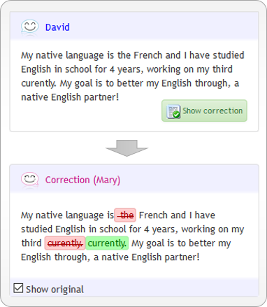
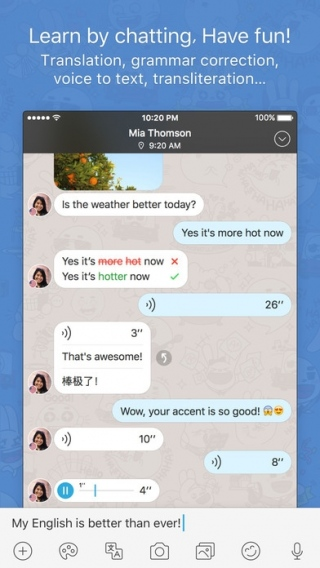

## Background

One of the major cornerstones of language exchange is the ability to correct your language partner if they make a grammatical or spelling error. While some apps support inline corrections, Linguistic aimed to actively aggregate corrections and store them in a single, unified location for users to reference whenever they want. The corrections experience should be social in nature and give users the ability to transform corrections into community forum posts, where other users are rewarded for commenting and offering insight on what was said incorrectly if the user does not understand their partner's explanation. This means that the encompassing design would need to consist of several flows: correction submission, reception, and discovery.

## Research

  
  

## Wireframes

## Hi-Fi Explorations

## Final Product
