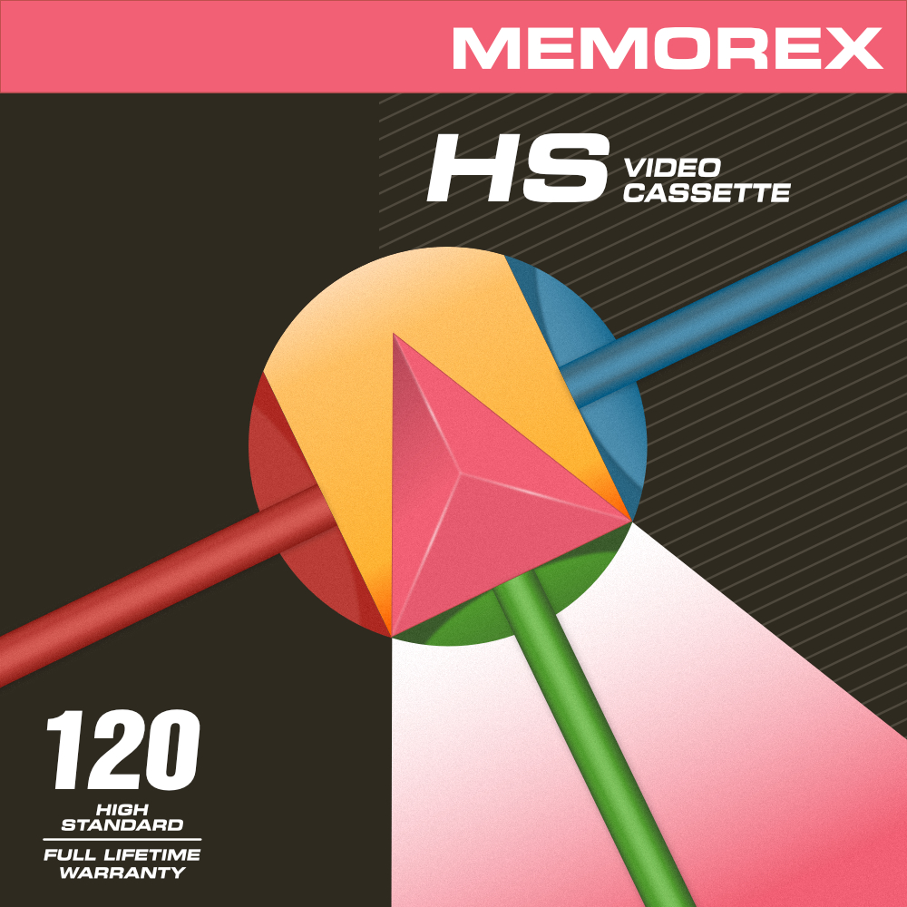
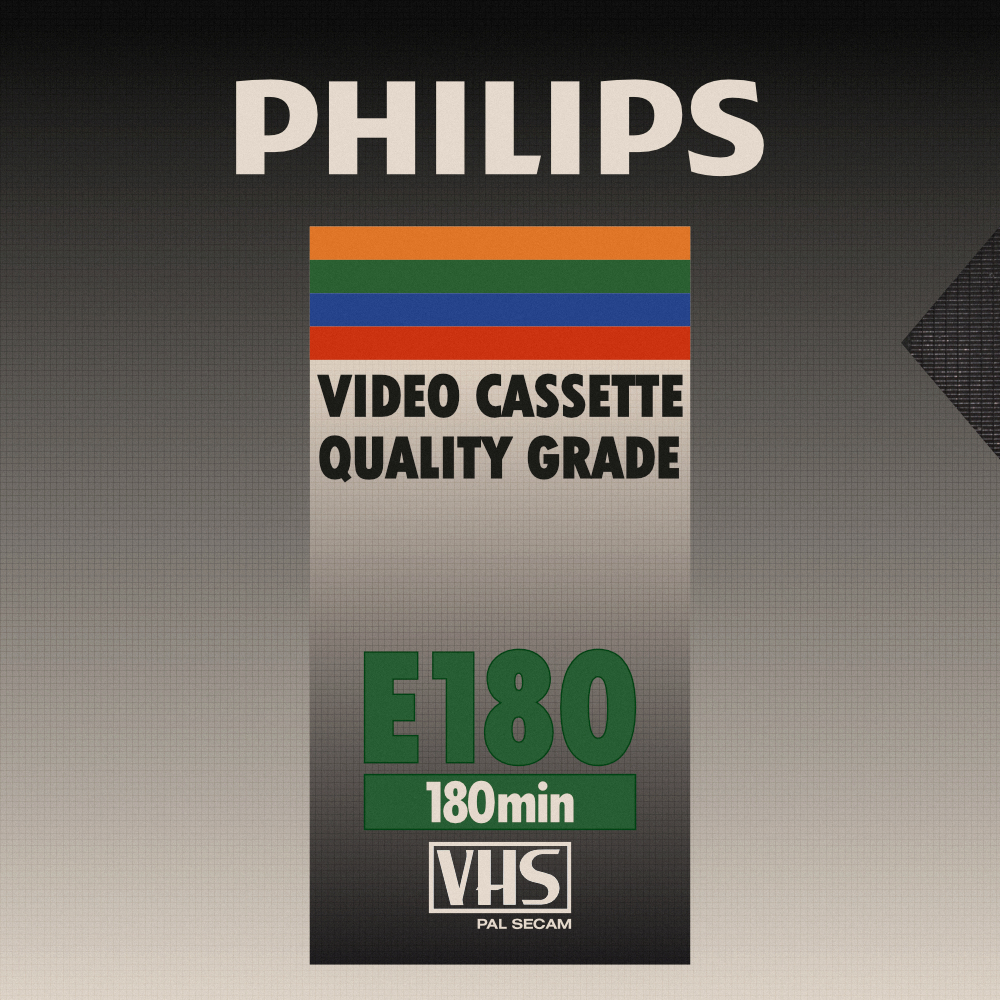
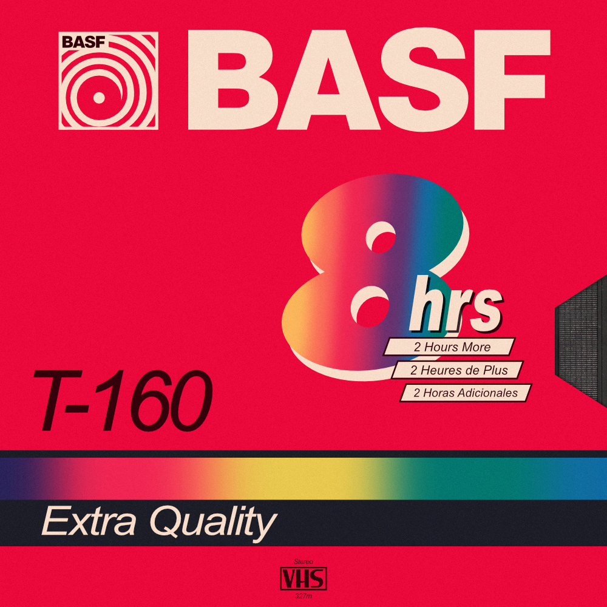
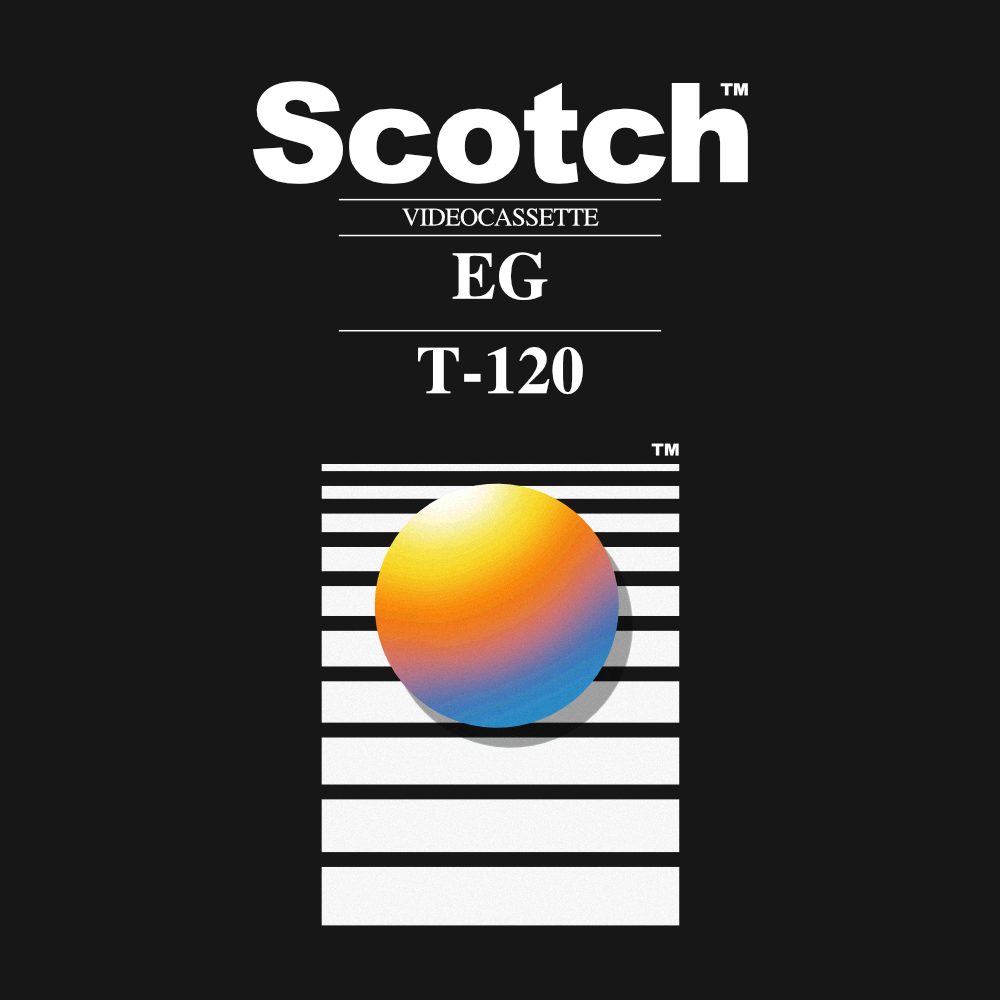
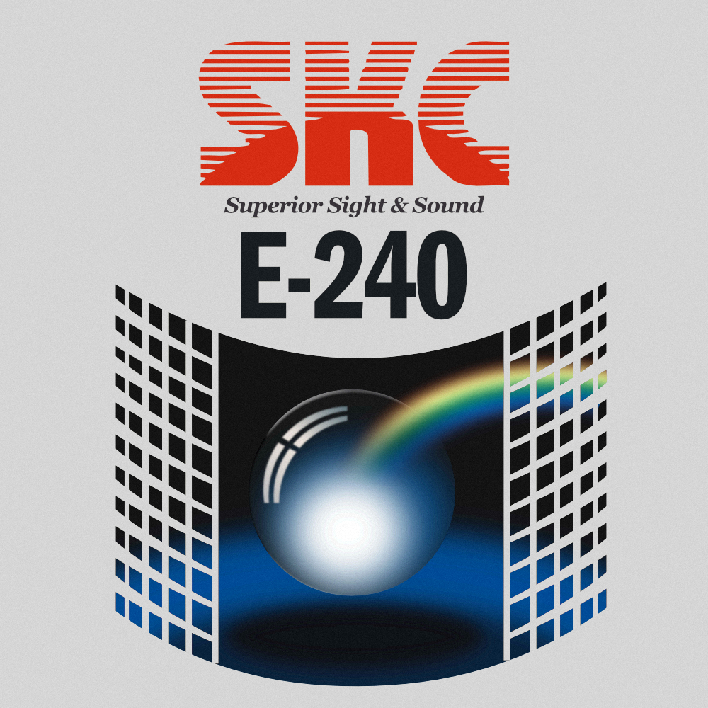
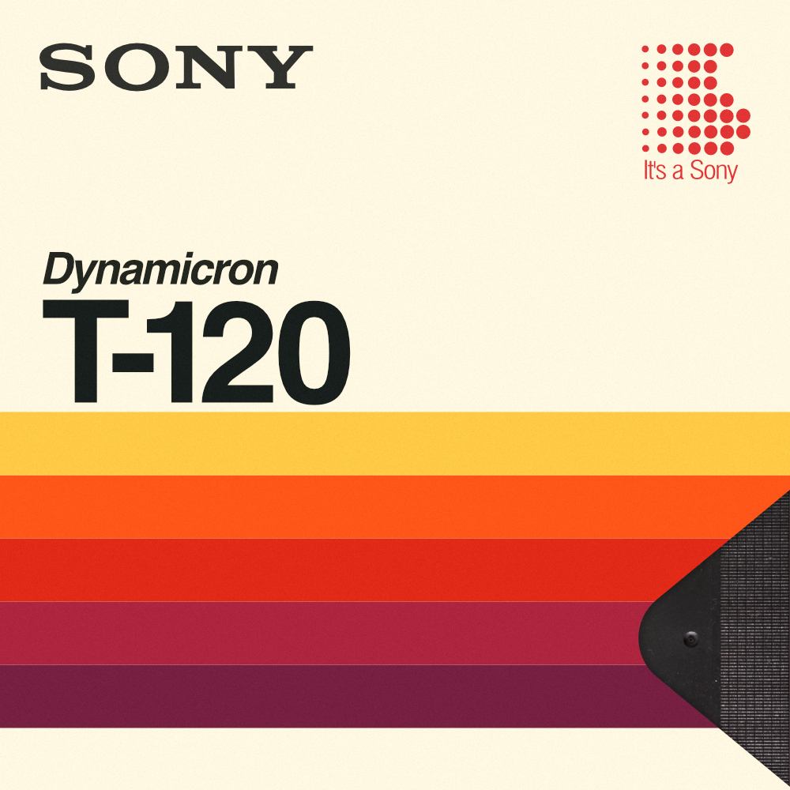
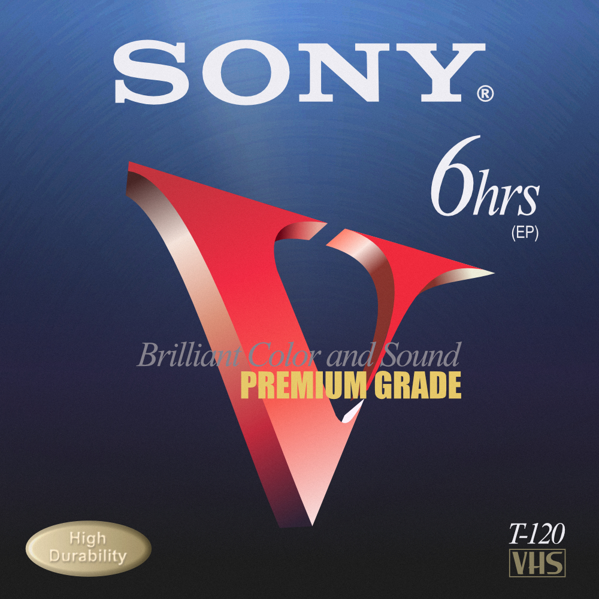
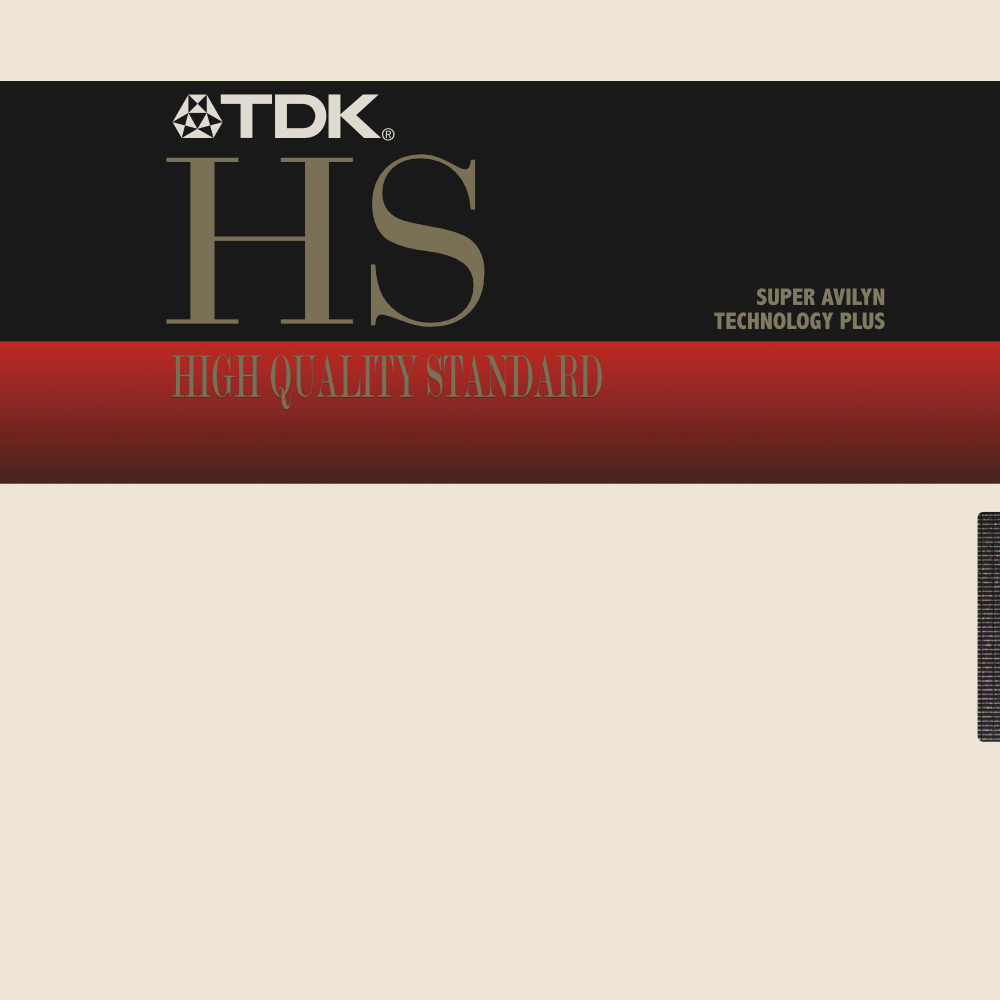
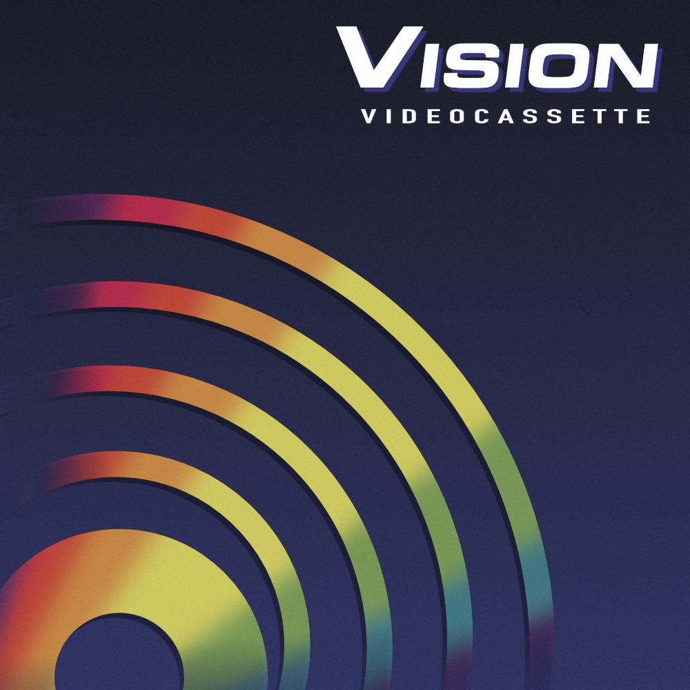
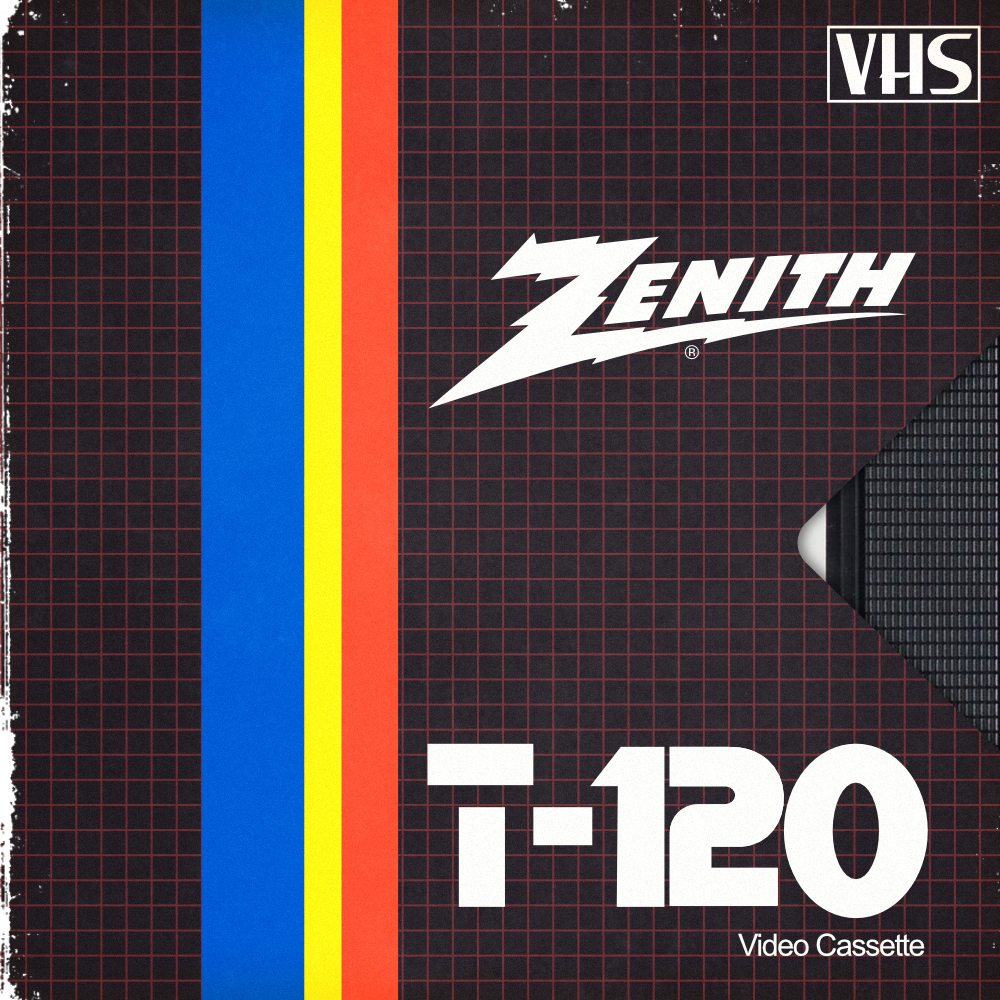

I'm a 90s baby. Always have been, and always will be. Though I don't necessarily remember many of those early years, what always personally stood out to me about the 90s was its distinctive art style. The majority of designs involved basic geometric shapes, zig zags, swirls, and 3D objects. Oh, and let's not forget the [infamous "jazz" pattern](https://www.dailydot.com/unclick/90s-jazz-cup-design/). While times may have been simpler back then, graphic design was not. The art style captured on napkins, cups, posters: it was explosive, daring, skeuomorphic. It possessed an artistic complexity not seen nearly as often into today's media.

It has always perplexed me how designers of that era were able to produce such high-quality work with a fraction of the technology we have in the world today. Who would spend countless hours creating a 3D cube, or a painting of water droplets, just to have it appear on such a trivial product?

Was it really that easy? Looking for an answer, I decided to try to take a stab at it on my own. Thus I began digitalizing some of the most common pieces of 90s art I had lying around my house: blank VHS cases.

What you'll see below are a series of VHS cases, each painstakingly recreated as a pure vector image (SVG). Each case has been cropped and adjusted to highlight its unique artwork and style. Fonts were extensively researched and tested, and while some were no-brainers, such as Arial or Georgia, other obscure fonts were surprising near-matches, such as a Ukranian one that was used. Defunct company logos were either hunted down or manually recreated. A number of photo effects were applied to get 3D effects just right. Some cases you may recognize, some not. Some are from foreign countries, some by famous U.S. brands.

The list of covers may grow over time as I create more. For now, I sincerely hope you enjoy them.

Every font that was used in each piece is listed below its the piece's title.

 Helvetica Neue, Engravers MT")

<small>Any company logo in use is for fair use only, and does not signify an endorsement or an attempt to capitalize on their brand.</small>
