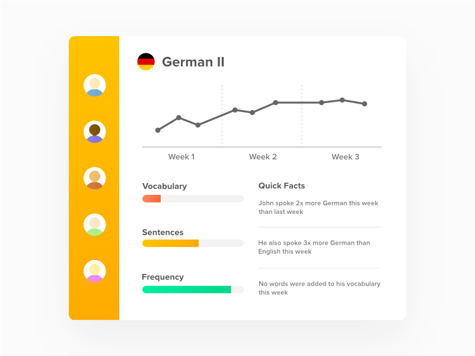
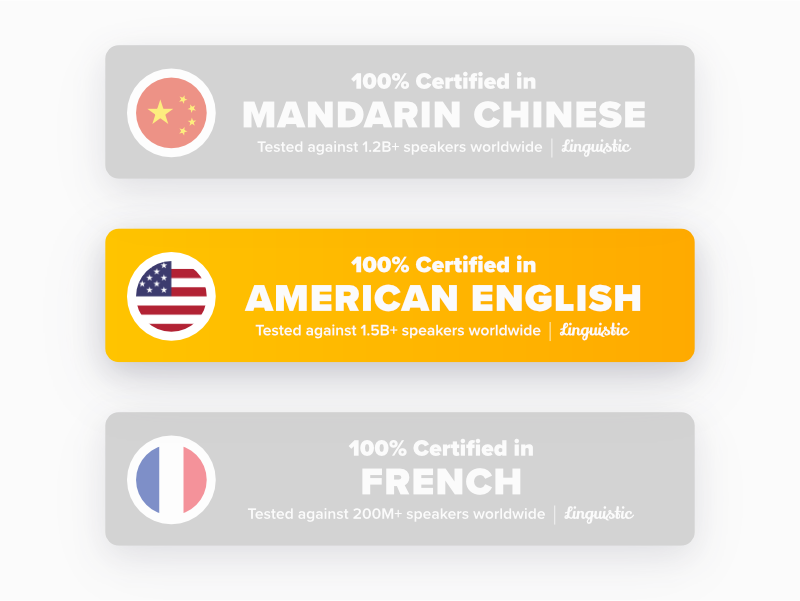
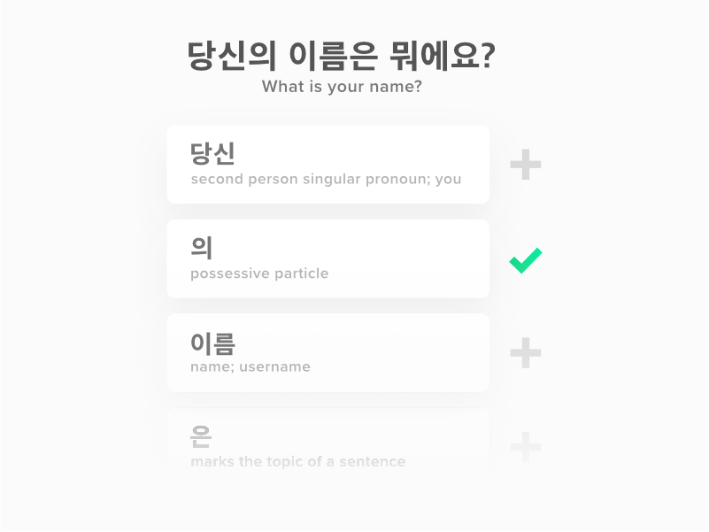
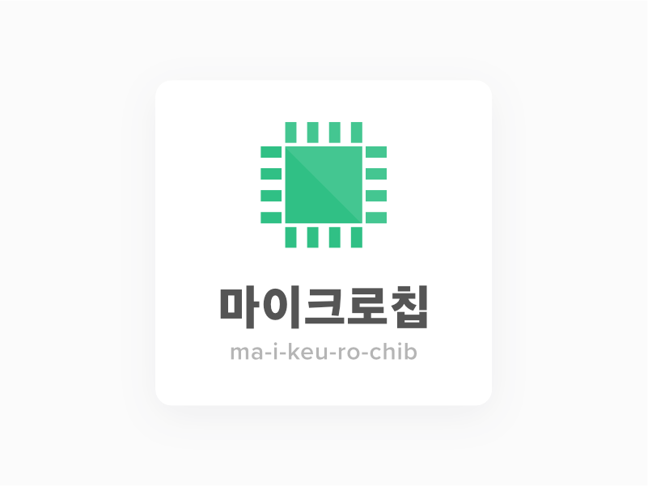
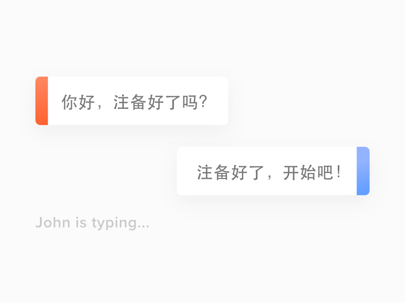
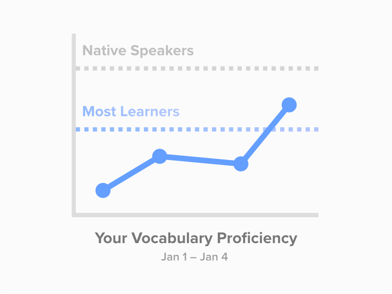
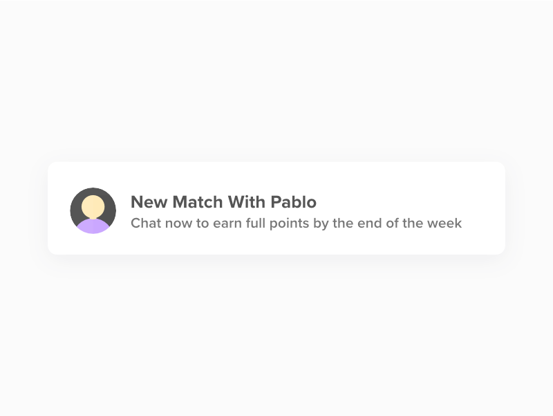
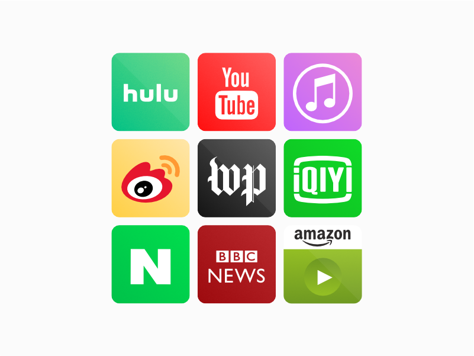
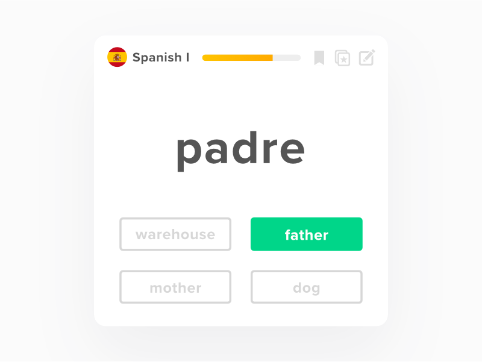

By far my proudest work to date, [Linguistic's](/projects/linguistic) design language was built from the ground-up, the product of constant evolution and iteration since the project's creation in 2015. While the product's current design language is somewhat derivative of the colorful, playful interfaces of apps such as Memrise or Duolingo, it was my goal to maintain a certain integrity to the app. There is currently no app mascot (well, yet anyway) and the UI opts for rectangle components as opposed to fully rounded ones.

## The Logo

It is my personal belief that word glyphs must support and blend with the typography chosen to render them. You can not simply pull any font family, throw it on top of any word, and expect it to flow. As such, the font family and style of the Linguistic logo changed with each rename that occurred during its early development.

Originally named WorldTongue, Linguistic initially employed a logo that utilizes a very compact, bold, and squarish type, playing into the name's geometric components (the abundance of diagonal and horizontal lines):

. Unknown to me at the time, the tagline I chose is almost identical to that of competitor app HelloTalk.")

While certainly not horrific, the logo still felt awkward. Apart from my distaste of the somewhat lackluster name, the short drop shadows and vertical gradient created a sense of 3D text, which I felt was somewhat childish and dated. It felt like something you would find in Microsoft Word 2003 WordArt.

Fortunately, no domain had been purchased yet. I could still change the name. Next up was "Linguist" (which now is dangerously close [Lingvist](https://lingvist.com/), so maybe it's for the best the name was never used). With Linguist, I experimented with a narrower type, reminiscent of something Microsoft might use:

")

With Linguist, the logo's style was much cleaner and breathed new life into the app. I used lighter, airy colors to make the app feel less industrial (vs. WorldTongue's red and gray palette). The orange used would actually make its way into the final logo.

However, I still wasn't 100% sold on the font family. The curves used in various letting conflicted with the geometric sans look the family was aiming for. I was also starting to doubt my "double-color" approach to the logos. I eventually decided that the logo should be one word, one color, and represent the playful side of what was being built. I realized that up until this point, I was basically designing the logo for some new snazzy B2B application. The product's logo should be playful, fun, and expressive. So far, none of my logo attempts it the mark.

So the app became Linguistic. I decided on a script type for the logo, which I felt was appropriate for a product with a name like "Linguistic". It used a single shade of orange (on light backgrounds) and white (on dark backgrounds). In my head, the logo did the job and it did it well:

")

The above logo remained Linguistic's primary logo for the majority of its development. It wasn't until 2017 that a new look was pursued, one that leverages an orange gradient and subtle shadows to make the app appear punchier and pop:

")

Today, the above Linguistic wordmark is used in the Linguistic mobile app, homepage, and related products. A truncated white version was placed over an orange gradient with an added longshadow to create the app's official icon:

")

## The Product

Just like its logo, Linguistic as a product was the result of constant iteration and experimentation. The first version of Linguistic ever looked something like this:

")

One textbox. One logo. One list of messages. That was it. As mentioned in my [technical writeup](/projects/linguistic), Linguistic started out as a chatroulette for language learners. The main web app was intended to appear as a slimmed down, cleaner version of [Omegle](https://omegle.com). In fact, the above version didn't even allow you to select which languages you were learning. I basically started out by building my own Omegle and then customizing it.

