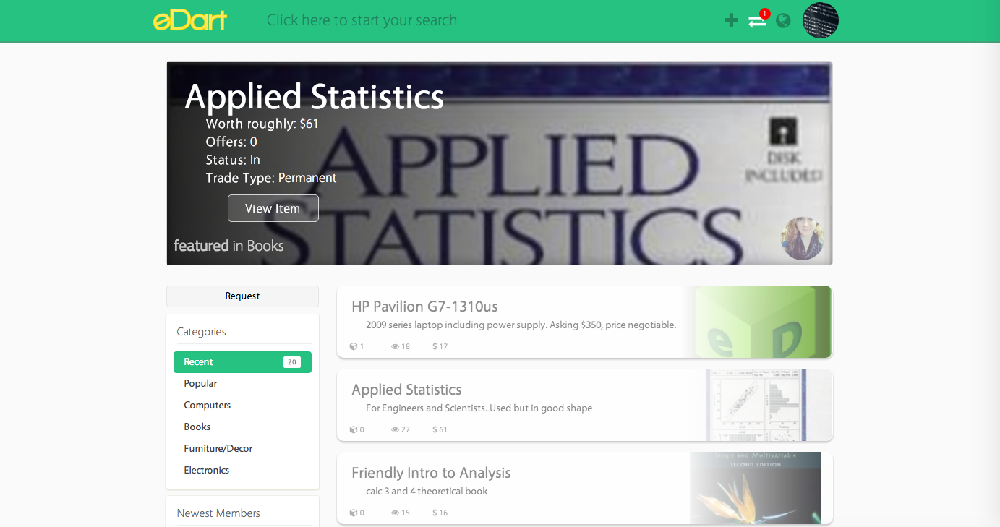
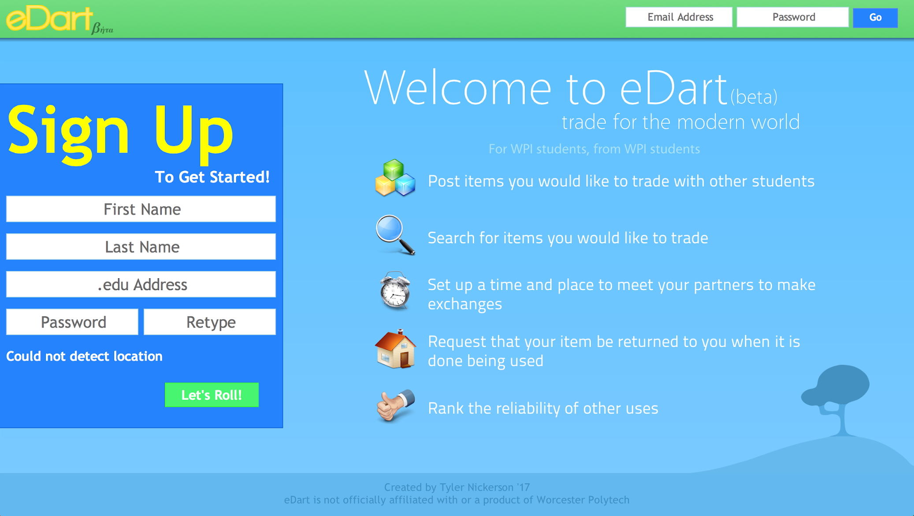
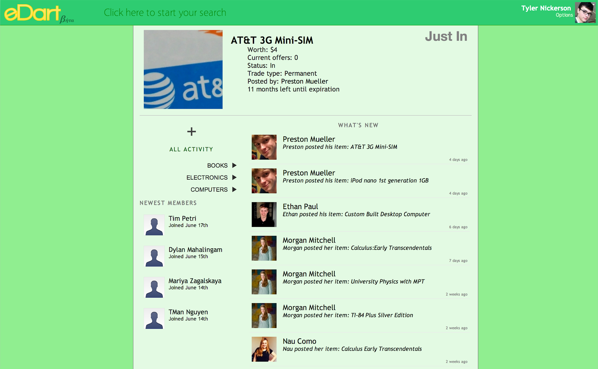
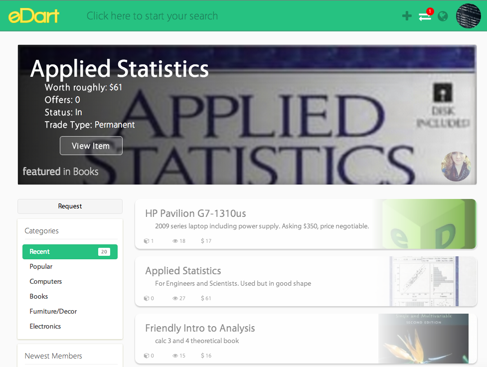

### Overview

eDart was an online hyper-localized e-commerce website for exchanging material goods. A predecessor to current companies such as LetGo, eDart was focused primarily on trading items as opposed to purchasing them, and initially aimed at college students. Students could consult the system for course materials they need and barter their own possessions with fellow classmates in exchange for them.

Eventually the service failed due to a number of fundamental structural and UX issues, shutting down in the fall of 2014, just over a year after it went live. Prior to shutdown, nearly a hundred students had signed up and several items had been posted, though none had been successfully bid on or exchanged. Ultimately, eDart was abandoned in favor of Fission, which would also fail a few months later due to similar problems.

### About

How the platform worked was very simple. Users would upload items they no longer needed, then fellow users would find their item and place "bids" on the item using their own item. If the original poster accepted an offer, they would be entered into a chat environment allowing them to set up a time to meet and exchange items.

In order to assure trades were roughly equal (so you don't trade a pencil case for a laptop), every time you'd post an item it would be searched on eBay as "used", so to produce an estimated market value (EMV):

 feature")

In an early version of the website, the about page was nothing more than a short text file describing the purpose of the site and why I built it. For sake of historical accuracy, humor, and a dash of nostalgia, the original file (circa mid-2013) has been reproduced below.

Please note that the tone or content of this text does not reflect my current person. I think at the time it was my very poor attempt to seem humorous and relatable.

<pre style="max-height: 300px">
Yo.
My name is Tyler Nickerson.
Who am I?
GOD.

Just kidding.
I am a nineteen year old freshie at Worcester Polytechnic Institute in Worcester, MA.
(wippie as Preston calls it).

Now for the burning question, why is there no CSS on this page?
Well, I figured that this site is going to be all about eDart, not me.
So I don't wanna draw too much attention away from the site I made.

Now, second burning question, why eDart?
Well, basically, I wanted to see what would happen if all monetary transaction was removed from society.
I mean, we don't all just have money to blow, do we?

Why buy new books every semester, or that new calculator you need, or that new binder, when
people have stood in the same shoes you're currently in?
You can just borrow from them.

But, to keep it fair, you need to offer something in return.
But not everyone wants to just give up their stuff for someone
else's hand-me-downs. So that's why users can opt to have their stuff returned eventually.

And that's how the concept of loan-based trading was invented
(true story, kids!)

Or not.
If you want to give away your stuff, you can.
That's an option too.

All up to you, kid.

PS: Quick shoutout to Preston Mueller for helping with some of the server config, and WideImage and JCrop for their ever-so-userful PHP and JS libraries for me to use. That is all.
</pre>

### Design...?

eDart was written from the ground up in PHP 5 without the use of any backend frameworks or architectures. Routing was extremely straightforward, each route existing only as a directory containing a single `index.php` file. All dependencies were checked into the repo directly, and all API endpoints were defined as part of the same server. Real-time data, such as user conversations, were handled by [long-polling](https://www.pubnub.com/blog/2014-12-01-http-long-polling/). User images were uploaded via form data, then saved on the server and referenced in the database.

If all of this sounds extremely basic it is because it is. Infrastructure was never a high priority with eDart when it absolutely should have been. Not going to sugarcoat it: the codebase was an utter mess. Some of the worst work I've ever done, but also some of the most rewarding. Luckily for you, eDart is open-source now. You can read it in all of its spaghetti glory [here](https://github.com/Nickersoft/eDart).

### Retro

As I mentioned, eDart, despite its temporary success, was flawed from the inside out. The codebase was a mess. It went through several design iterations before it felt like a real website. It was missing core functionality that would have made using it _so_ much easier.

That said, I learned a lot.

In fact, eDart may have been single handedly the most educational project I've ever worked on. It was my first time building a web project at scale. Let's take a look at some core lessons learned, shall we?

#### (Almost) never build your own MVC framework.

As cool as it is to tell people that my first website didn't use any kind of backend framework, at the time that was a horrible decision on my part. Frameworks like [Laravel](https://laravel.com/) exist for a reason, so you don't write spaghetti code that looks like it was from 2004. Unless, of course, you know what you're doing. Nineteen year-old, for one, me did not.

Directories as routes? Really? That doesn't scale. At all. Especially if you're dealing with dynamic routes, which fortunately I didn't have to back then. What was I thinking?

#### Libraries exist to help you, not hurt you.

This is going to sound really stupid. The first versions of eDart used nearly _zero_ dependencies of any kind, including jQuery. Any logic from any existing framework was rewritten and added to the project's in-house scripts. I didn't believe in relying on anyone else for any reason.

Some of you may still agree with the decision to use zero dependencies. That's okay. It's a double-edged sword. On one hand, libraries exist so you can utilize certain functionality without thinking about how to write it yourself. On the other hand, the more dependencies you use, the more you open yourself up to vulnerability. In the case of eDart, where every PHP and JS dependency was checked into the repo, the risk was nonexistent. However, if you're using a package manager like NPM and your dependency is compromised, you're giving it the potentially to inject malicious code into your codebase.

Foregoing libraries when eDart started probably cost me a lot of engineering time I could have been using the build better features. Eventually, eDart did become very dependency heavy, using libraries such as jQuery, WideImage, PHPMailer, UIKit, Bootstrap, JCrop, etc. At that point, however, the damage had already been done.

#### You can't make everyone happy

When I first started developing for the web, I wanted to maximize cross-browser compatibility. This meant going out of my way to support browsers like Internet Explorer 6-8, older version of Opera, etc. As a result, eDart's code often would up becoming cumbersome and convoluted. I used [CSS3 Pie](http://css3pie.com/) heavily, which would apply CSS3 styles in older versions of IE using JavaScript. All web fonts were applied at runtime via JavaScript. I remember at one point I was literally calculating font sizes using JavaScript. Who does that? Seriously.

You can't make everyone happy, and nowadays, you shouldn't have to. Users should be expected to use a fairly recent browser, and for those who don't, you can use tools such as [Autoprefixer](https://github.com/postcss/autoprefixer) or [Polyfills](https://polyfill.io/v2/docs/) to add the missing functionality to their legacy browsers. Compatibility should always be at the forefront of your mind, but you shouldn't feel obligated to kill yourself or compromise your code quality over it. It's the reason tech requirements exist.

#### How to be a better designer

eDart was my first real brush with visual design, and to this day is probably the project whose UI changed the most drastically and the most often. I talk about several of the basic design principles I learned through eDart in my [recent article on beginner design tips](http://localhost:8000/publications/designing-as-a-developer-in-2018).

When the app started out, the UI consisted of a bright blue and lime green. If that doesn't already sound disgusting, see for yourself:

Over time, I eventually came to the conclusion: **two or more primary colors bordering each color in a UI looks absolutely dreadful, especially if they aren't complements of one another.** I then started decided to cutback to a singular brand color, green, but managed to overuse it _way too much_:

By mid-to-late 2014, I had finally started to realize that **primary colors should be used to _accent_ your interface, not dominate it.** I left the green nav bar and gave the rest of the interface a warm monochrome palette:

Much better, right?
