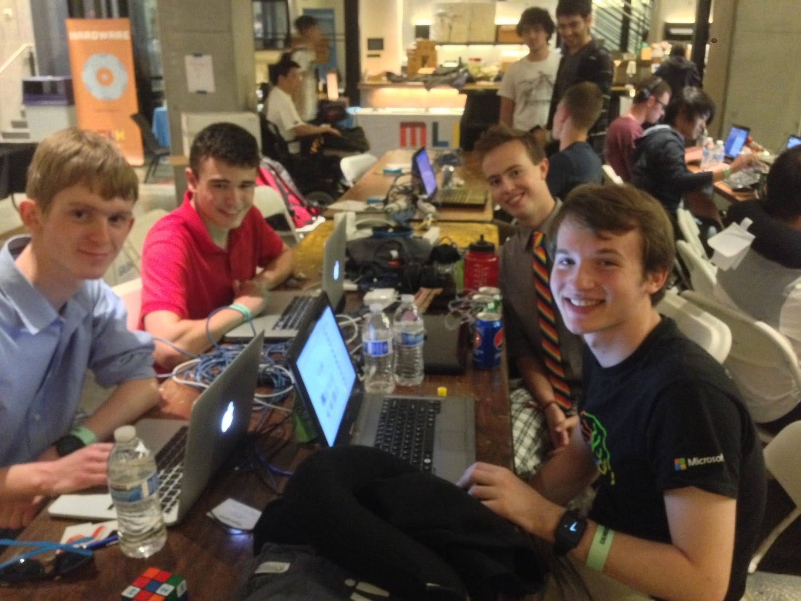

### Overview

Fission was an early attempt at creating a decentralized cloud storage network, prior to the surge in blockchain-based solutions that now saturate the market. Launched shortly after competitors such as [Storj](https://storj.io/), Fission utilized an erasure encoding approach for chunk distribution as opposed to more popular blockchain techniques. Ultimately, the project failed after a number of months after the team failed to settle on an approach that would ensure network nodes remaining on and active for a period of time so users can retrieve their files. This is a well-known issue in distributed cloud storage, and many companies such as Storj attempt to resolve it by contractually obligating hosters to leave their devices on for an agreed-upon period of time. We wanted our network to be completely free – and by not charging people to store their files, or paying people to host the files of the others – there was no workable solution to the aformentioned problem.

### Motivation

In modern cloud storage, the majority of networks have a single point of failure. Your uploaded files wind up on a single server in a single data center, where a single person or organization could access it. If that server went down and your file was not backed up, it's gone forever. By uploading files to a decentralized network, the files are split into chunks at upload time and stored on multiple nodes (computers) in a distributed network. This means that your files are untracable, secure, and completely private. By looking at random chunks alone, no one can tell what your file is until you decide to merge the chunks and download it. Think of it like shredding a document, where only you know how to tape the pieces back together. The concept of storage decentralization has become popularized in recent years, notably with Richard Hendrick's idea of a "decentralized internet" in the TV show [Silicon Valley](<https://en.wikipedia.org/wiki/Silicon_Valley_(TV_series)>). As of today, no one has perfected its commercial execution.

### Background

Fission was developed at UC Berkley in 2014 as part of CalHacks, the [university's biannual hackathon](https://calhacks.io/). The idea arose when team member Preston Mueller mentioned reading how the future of storage on the Internet is full decentralization. The project continued past the end of the hackathon, with many team members discussing droppping out to pursue the venture full-time. While my own remained primarily focusued on the web / front-end components of the core product, I also spearheaded development of the product's branding, logo, promotional material, as well as its Mac client. In the weeks after the hackathon, classmate and colleague Nick Cyganski became involved as a business advisor. The project came to an unfortunate end after the team members were pulled away by school and internships, and the fundamental issues with the product were not able to be resolved.

###
