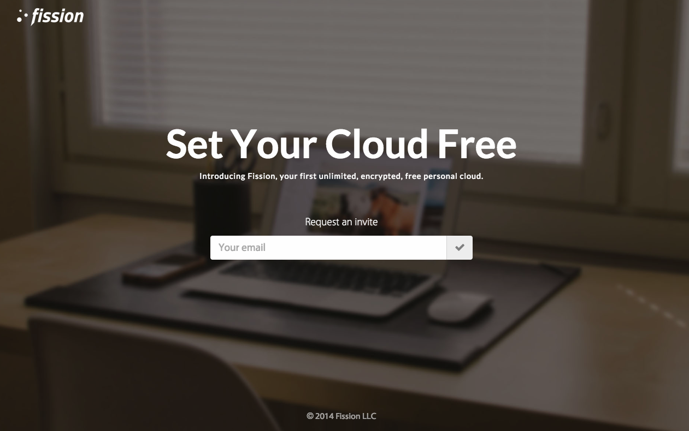

### Overview

Fission was an early attempt at creating a decentralized cloud storage network, prior to the surge in blockchain-based solutions that now saturate the market. Launched shortly after competitors such as [Storj](https://storj.io/), Fission utilized an erasure encoding approach for chunk distribution as opposed to more popular blockchain techniques. Ultimately, the project failed after a number of months after the team failed to settle on an approach that would ensure network nodes remaining on and active for a period of time so users can retrieve their files. This is a well-known issue in distributed cloud storage, and many companies such as Storj attempt to resolve it by contractually obligating hosters to leave their devices on for an agreed-upon period of time. We wanted our network to be completely free – and by not charging people to store their files, or paying people to host the files of the others – there was no workable solution to the aformentioned problem.

### Motivation

In modern cloud storage, the majority of networks have a single point of failure. Your uploaded files wind up on a single server in a single data center, where a single person or organization could access it. If that server went down and your file was not backed up, it's gone forever. By uploading files to a decentralized network, the files are split into chunks at upload time and stored on multiple nodes (computers) in a distributed network. This means that your files are untracable, secure, and completely private. By looking at random chunks alone, no one can tell what your file is until you decide to merge the chunks and download it. Think of it like shredding a document, where only you know how to tape the pieces back together. The concept of storage decentralization has become popularized in recent years, notably with Richard Hendrick's idea of a "decentralized internet" in the TV show [Silicon Valley](<https://en.wikipedia.org/wiki/Silicon_Valley_(TV_series)>). As of today, no one has perfected its commercial execution.

### Background

Fission was developed at University of California Berkley in 2014 as part of CalHacks, the [university's biannual hackathon](https://calhacks.io/). Originally named Polydrop, The idea was born when team member Preston Mueller mentioned reading how the future of storage on the Internet is full decentralization. The project continued past the end of the hackathon, with many team members discussing droppping out to pursue the venture full-time.

While my own remained primarily focusued on the web / front-end components of the core product, I also spearheaded development of the product's branding, logo, promotional material, as well as the OSX client. In the weeks after the hackathon, classmate and colleague Nick Cyganski became involved as a business advisor. The project began to dwindle after the team members were pulled away by school and internships, and the fundamental issues, such as network incentives, with the product were not able to be resolved.

: myself, Jason Prince, Erik Nadel, Preston Mueller.")

### System Design

Much of Fission's original infrastructure was designed by team member and Stanford student Jason Prince, who helped to flesh out many of the edge cases we'd need to consider when expanding the platform. The original design of the Fission system was as follows:

When users first register with Fission servers, their passwords are hashed and salted with a 256-bit salt. When they authenticate with the servers, their passwords are retrieved and entered into scrypt, a PBKDF2-derived key derivation protocol on the client system. Their hashed password is used as the salt during this encryption. The resulting key is then used to encrypt and decrypt all file uploads.

When users upload files, Fission first returns a list of all available network nodes, as well as a handful of Fission-owned distributed "buffer" servers to ensure the file can be successfully uploaded. This data is passed to client as dictionary mapping of device secrets to the IP addresses of those devices. The file is then encrypted using the derived encryption key and run through a Solomon-Reed Erasure Coding algorithm that splits the file into _k_ chunks. The SREC algorithm was chosen due to its ability to restore the complete file even without every original chunk. The chunks are then sent to the retrieved devices using a peer-to-peer (P2P) protocol. Device preference is chosen due to the device's reliability rating. A solid equation for calculating a reliability rating was never produced, though its factors would have included device uptime, speed, and overall reliability. Once a file upload completes, a signal is sent over a socket connection to the client to signify completion.

Lastly, Fission would only allow you to upload the same amount of storage you were willing to host on your own machine, with additional cloud storage being rewarded to the owners of devices with higher reliability ratings. In other words, you could upload 5GB to the network if you were willing to host 5GB worth of other people's chunks on your machine. If your device was particularly reliability, you may be awarded an additional 1GB. The WIP equation for determining your allowed allotted space was:

$$
GB(s, c) = c \cdot \frac{s}{168}
$$

