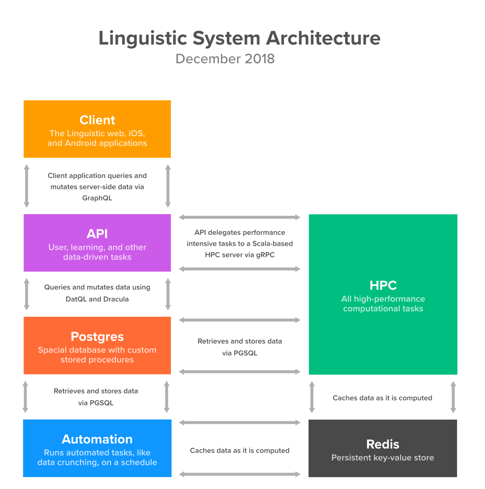

### Overview

Linguistic is the first language learning platform whose curriculum is derived solely from one-on-one conversations with native speakers and additional real-world resources. Instead of following the traditional, lesson-based approach apps such as Duolingo, Rosetta Stone, and Babbel use, Linguistic hand-matches you with native speakers in a bidirectional language exchange. While chatting, if you don't understand what your partner is saying, you can simply tap any message and view comprehensive information regarding the vocabulary they're using as well as grammar patterns. You can add this data to in-app study sets, and once you're well-reviewed, Linguistic will assist you in incorporating your newly learned words back into your conversations.

Additionally, Linguistic automatically tracks and graphs your vocabulary and grammatical proficiency as you converse, and recommends foreign news articles, music, and movies based on your inferred proficiency level. The project is the result of multiple years of research and prototyping.

You can read the latest paper discussing Linguistic's pedagogy, approach, and technology [here](/publications/linguistic).

### Motivation

While a number of language learning platforms currently exist, few if none focus on arguably the most important aspect of learning a new language: communication. Apps such as Lingodeer, Duolingo, Babbel, Rosetta Stone, and Memrise all treat language learning as if it occurs in a vacuum. You learn _x_ new words and you're expected to return to the app every day to reinforce your understanding of those words. In reality, individuals expand their understanding of a language through encounters: someone you're speaking to uses a word you don't recognize, song lyrics don't make sense, you pick words out of a paper you're reading. Why shouldn't modern language learning technology operate the same way?

### System Design

To this day, Linguistic has the most sophisticated architecture of any codebase I've worked on. The system consists of multiple microservices and tops 115,000 lines of code. All client apps communicate to a central GraphQL API, which delegates high priority tasks to a distributed Scala service. The Scala service, along with automated server-side scripts, cache computed data in a persistent [Redis](https://redis.io/) store. The services are best illustrated as:

### Visual Design

In my own personal opinion, designing Linguistic's UI and brand is some of the best design work I've done in years, and I'm extremely proud of it. You can read more about its design [in my portfolio](/portfolio/linguistic).
